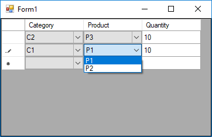

# DataGridView Cascading ComboBox Example

Sometimes you need too have cascading combobox in `DataGridView`. For example, let's suppose you have this classes:

* Category:  int Id, string Name
* Product:   int id, string Name, int CategoryId
* OrderItem: int? CategoryId, int? ProductId, int Quantity

And you have some lists that contains all Categories, Products and OrderItems.

And you want to show order items in grid and let the user select category and product from combo boxes. When the user selects a category, we want to show only product of that category in combo of products.

To have dependent (cascading or master/slave) `ComboBox` columns in `DataGridView`, you can follow this steps:

 1. Set `DataSource` of slave column to all available values.  

     ***Goal:*** Here the goal is prevent rendering errors at first load, so all slave combo boxes can show value correctly.

 2. Hanlde `EditingControlShowing` event of the grid and check if the current cell is slave combo cell, then get the editing control using `e.Control` which is of type `DataGridViewComboBoxEditingControl`. Then check the value of master combo cell and set the `DataSource` property of editing control to a suitable subset of values based on the value of master combo cell. If the value of master cell is null, set the data source to null.  

     ***Goal:*** Here the goal is setting data source of slave combo to show only suitable values when selecting values from slave combo.

 3. Handle `CellValueChanged` and check if the current cell is master combo, then set the value for dependent cell to null.  
    *Note:* Instead of setting the value of slave cell to null, you can set it to first available valid value based on master cell value.  

     ***Goal:*** Here the goal is prevent the slave combo to have invalid values after the value of master combo changed, so we reset the value.

Following above rules you can have as many dependent combo boxes as you need.